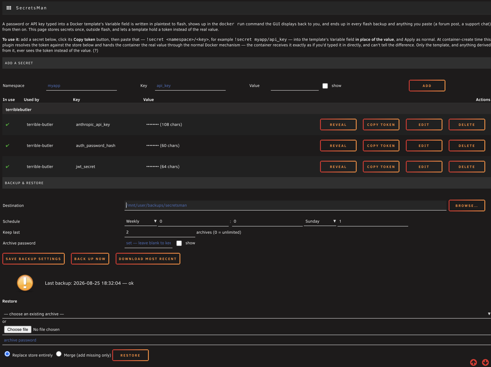

# unraid-secretsman

Central secret storage for Unraid Docker templates, so a secret typed into the Docker GUI
doesn't end up in plaintext everywhere that template gets copied, pasted, or backed up.

## The problem

Today, a password or API key typed into an Unraid Docker template's variable field shows up in
plaintext in three places at once:

- the `docker run` command the GUI displays back to you,
- the template XML at `/boot/config/plugins/dockerMan/templates-user/my-*.xml`, and
- any log that captures either of the above.

The GUI's password-masking (the dots in the field) is **cosmetic only** — it doesn't touch the
stored value, the displayed command, or the XML.

That template XML and that command string are exactly the things people routinely copy and
paste — into chat, into a GitHub issue, into a forum post asking for help — and it is very easy
to forget a value is sitting in there unredacted until after you've hit send.

With this plugin, both artefacts stay clean by construction: the template XML holds only
`!secret ns/key`, and the command the GUI displays holds only
`--env-file=/run/secretsman/env/<container>.env`. There is nothing to redact because the secret
was never in either string. That's the only thing this plugin does, and it's the reason it
exists — see SECURITY below for exactly what that does and doesn't cover.

**Limit, stated plainly:** this covers the template and the displayed command — the two
artefacts people actually paste around. It does not, and cannot, stop you from copying a value
straight out of the store editor or out of a running container's own configuration; nothing
automated protects you from *that* copy-paste.

It also closes a second, related problem: everything above is likewise true of your **flash
backup**, which is a full copy of that same template XML. A secret typed into the GUI today is
in plaintext in every flash backup you take, or that gets taken for you, for as long as that
backup exists.

## What this does

Store your secrets once, outside flash, and reference them from a template field with a token:

```
!secret terriblebutler/anthropic_api_key
```

At container-create time, the plugin resolves the token against a central store and rewrites
the docker command so the template XML — and therefore your flash backup — only ever contains
the token, never the value. The value is written to a `root:root 0400` env-file on tmpfs and the
variable is replaced with a single `--env-file=` reference; the template XML never sees the
value.

There is no file-based mode. An earlier `!secretfile` variant (bind-mounting the secret as a
file, for apps that read from `_FILE`/`FILE__` paths instead of environment variables) was
removed — see SECURITY below for why.

## Managing secrets

A Settings page (**Settings → User Utilities → SecretsMan**) handles the store without SSH:
add a secret, click **Copy token** on its row, and paste the exact `!secret ns/key` string into
the template's Variable field in place of the value. A revealed value is never in the page
source until you explicitly click Reveal on that one row; every other view only ever shows a
length. The page also scans your saved templates and flags any `!secret` token that doesn't
match a stored secret, or doesn't parse at all — the two mistakes that used to fail silently.



The store also stays hand-editable at `/mnt/user/appdata/.secrets/store.json` — the page is an
alternative, not a replacement.

## Backup & restore

`/mnt/user/appdata/.secrets/` is dotfile-prefixed, which common appdata-backup tooling
routinely skips — without this, the store had no copy anywhere. The same Settings page has a
**Backup & Restore** section: set a destination and a password, then back up on a schedule or
on demand. Archives are encrypted (7-Zip/AES-256 if you happen to have 7-Zip installed — not
stock Unraid — otherwise `tar` + OpenSSL AES-256, both always present) and every archive is
decrypted and validated immediately after creation, before being considered a successful
backup. A plain-text `README-RESTORE.txt` is written alongside every archive with the exact
restore command for that specific file — readable without this plugin, in case you find it
somewhere with no other context.

**The archive password is not stored in the archive, and not on flash.** It lives beside
`store.json` itself, `root:root 0600`. Stated plainly: root on this Unraid box can already read
`store.json` directly, so this doesn't add a new way in — the password's actual job is
protecting the archive once it leaves this host (downloaded, copied elsewhere).

Restoring supports two modes: **replace** (the archive becomes the store, full disaster
recovery) or **merge** (only adds keys that aren't already present — anything already in the
store is left untouched, never silently overwritten).

## Compatibility

Verified on **Unraid 7.3.1**. Other versions are not assumed compatible: the patch is
checksum-guarded against known-good hashes in `reference/<version>/HASHES`, so on any version
without a matching entry it **refuses to apply and raises a notification instead of patching
blindly** — the system is left exactly as it was, not partially or incorrectly patched. See
CLAUDE.md's "Insertion point" and rule 4 for why this is the whole point of the design.

## Install

Not in Community Applications. Install by URL from the **Plugins → Install Plugin** page, using
the `.plg` URL from the latest
[GitHub Release](https://github.com/kmbrimble/unraid-secretsman/releases). **No release has been
cut yet** — see `CLAUDE.md`'s Phase roadmap for what's gating that.

## SECURITY

Read this before you rely on this plugin.

**What `!secret` closes — exposures that leave the machine:**

- flash backups, including ones taken automatically
- the template XML, when it's shared in an issue, a forum post, or pasted into chat
- the `docker run` command the GUI echoes back to you, and any log that captures it

**What `!secret` does *not* close — exposures that already require root or docker-socket
access on the host:**

- `docker inspect <container>`
- `/proc/<pid>/environ`

`!secret` resolves to a real environment variable inside the container, so it's visible through
either of those. **This is deliberate, not an oversight** — anyone who can read `docker inspect`
output or `/proc/<pid>/environ` already has root or docker-socket access to the Unraid host, and
with that access they can simply read `store.json` directly. The plugin isn't leaving a hole next
to a locked door; it closes the exposures that *leave* the host (flash backups, a template pasted
into an issue or a chat, a command echoed to the GUI) and makes no attempt to guard on-host
inspection, because that access already opens every other door too.

An earlier `!secretfile` mode hid the value from `docker inspect`/`/proc/<pid>/environ` as well,
by writing it to a file the container bind-mounted instead of an environment variable. It was
removed (2026-08-25): the marginal protection it bought was against an attacker who could already
read the store directly, and the cost of keeping it turned out to be real — its tmpfs bind-mount
source had to be rewritten on every boot before Docker autostarted the container, and a live test
disproved the boot-ordering guarantee that depended on. See `CLAUDE.md`'s dated correction and
`docs/phase2-resume.md` for the incident. `!secret` is unaffected by any of this — it always
resolved at container-create time in the GUI, never at boot.

- **This plugin patches OS files.** It surgically modifies
  `/usr/local/emhttp/plugins/dynamix.docker.manager/include/Helpers.php`, a stock Unraid file
  that is restored from the OS image on every boot, which is why the patch has to reapply at
  boot. The patch is checksum-guarded and refuses to apply against a `Helpers.php` it doesn't
  recognise — see `CLAUDE.md` for the exact rule — but you are still trusting a third-party
  plugin to modify a core system file. Read the patch before you install it.
- **Recovery**: because `/usr/local/emhttp` is restored from the OS image every boot, a broken
  patch is undone by removing the plugin and rebooting — no OS reinstall required, and it's
  doable from another machine with the USB stick if the webGUI itself is unusable. See
  `RECOVERY.md`.
- **The store itself** lives outside flash (default `/mnt/user/appdata/.secrets/store.json`),
  `root:root 0600`. Only a pointer to its path is kept on flash. Protect it the way you'd protect
  any file holding plaintext credentials — it is not encrypted at rest.
- Resolved secrets are never written to any log, debug output, or error message by this plugin.
  If you find a case where one is, that's a bug — please report it.

## Status

Functional and verified live: the resolver, the boot-time patch, the Settings GUI, clean
removal (install → remove → confirm stock `Helpers.php` returns byte-for-byte), and backup
create/verify/prune all work on the recon host (Unraid 7.3.1). Scheduled-backup durability
across a real reboot, and a full restore rehearsal, are the last checks before a release — see
`CLAUDE.md`'s Phase roadmap. **Not yet tagged as a release.**

## License

GPL-2.0 (see `LICENSE`). This project vendors and patches GPLv2 files from Unraid's own
`dynamix.docker.manager` plugin (see `reference/`), which requires the same license.
